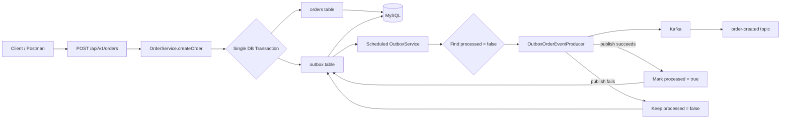
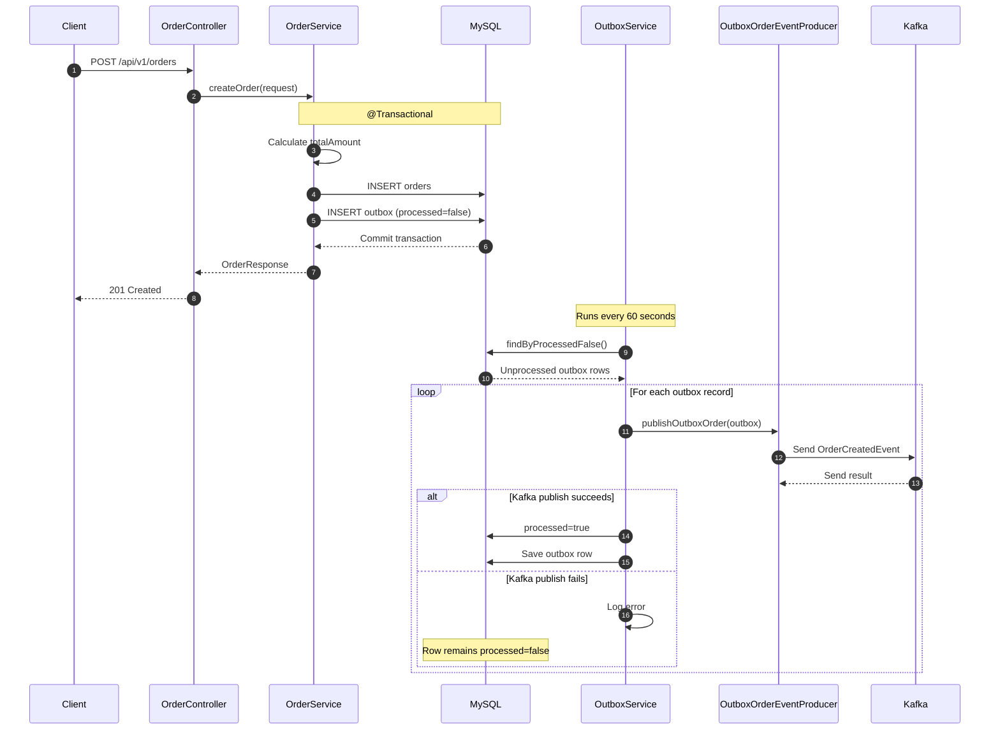
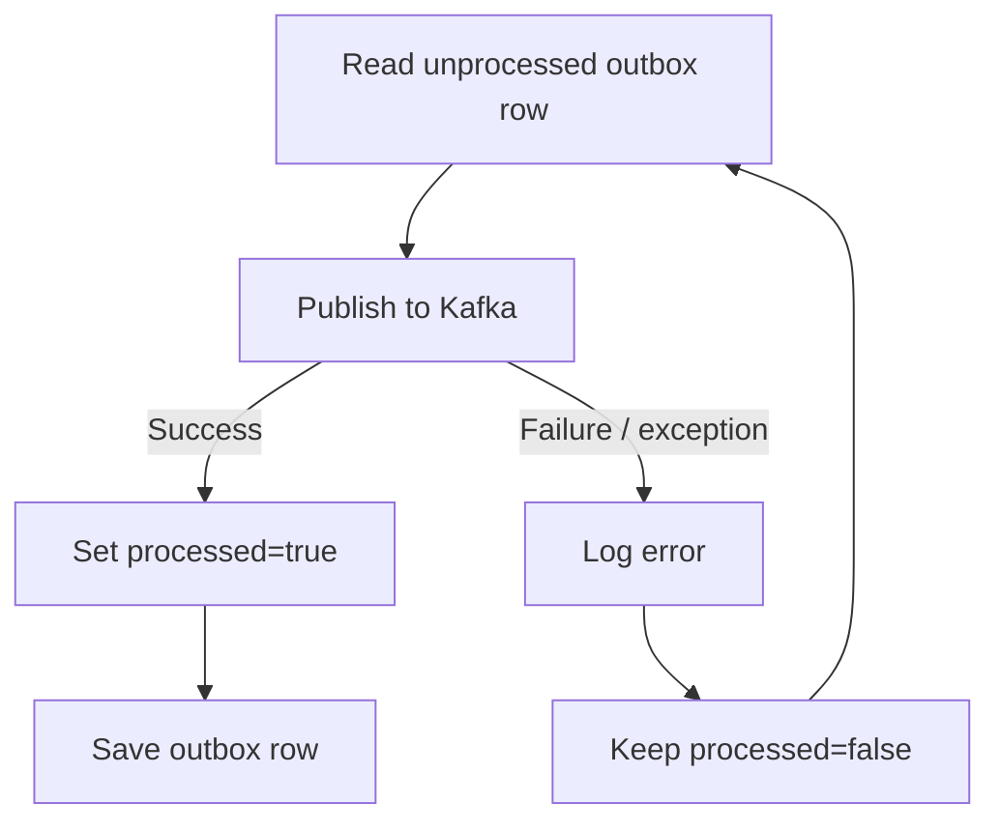

# Outbox Pattern App

A Spring Boot implementation of the **Transactional Outbox Pattern** using **MySQL, Spring Data JPA, Kafka, and a scheduled outbox publisher**.

> Repository path: `outbox-pattern-app/order-service`

## Architecture

This application currently contains one runnable service:

- **order-service** — creates orders, writes the order and its outbox event in the same database transaction, and periodically publishes unprocessed outbox records to Kafka.

The root Maven project uses **Spring Boot 4.1.1** and **Java 25**. The order service runs on **port 9003**, connects to MySQL at `localhost:3306/orders_db`, and Kafka at `localhost:9092`.

## Why the Outbox Pattern?

A common microservices problem is the **dual-write problem**:

1. Save business data in a database.
2. Publish an event to Kafka.

If the database write succeeds but Kafka publication fails, the system can lose the event. If Kafka succeeds but the database transaction fails, consumers may react to data that does not exist.

The outbox pattern solves this by writing the **business record and the event record to the same database transaction**. A separate publisher later reads the outbox table and sends the event to Kafka.

## End-to-End Flow



## Sequence Diagram



## Transaction Boundary

The important part of the implementation is `OrderService.createOrder()`:

```text
@Transactional
      |
      +--> save Order
      |
      +--> save Outbox
      |
      +--> COMMIT
```

The order and outbox record are committed together.

## Database Model

### orders

| Column | Purpose |
|---|---|
| id | Order identifier |
| name | Product/order name |
| customerId | Customer identifier |
| productType | Product type |
| quantity | Quantity |
| price | Unit price |
| totalAmount | price × quantity |
| createdAt | Creation timestamp |
| updatedAt | Last update timestamp |

### outbox

| Column | Purpose |
|---|---|
| id | Outbox row identifier |
| aggregateId | Order identifier used as event key |
| payload | Serialized order payload |
| processed | Whether the event has been published |
| createdAt | Outbox record creation timestamp |

## Kafka Event

The Kafka topic is:

```text
order-created
```

The event model is:

```java
public record OrderCreatedEvent(
        String aggregatedId,
        String payload
) {}
```

The producer uses the order aggregate ID as the Kafka message key:

```text
Topic: order-created
Key:   orderId
Value: OrderCreatedEvent
```

## Outbox Publishing Logic

The scheduled publisher runs with:

```java
@Scheduled(fixedDelay = 60000)
```

Every 60 seconds it:

1. Reads records where `processed = false`.
2. Converts the outbox row into an `OrderCreatedEvent`.
3. Publishes the event to Kafka.
4. Marks the row as processed after the publisher call returns without an exception.

### Failure Path



Keeping a failed record unprocessed allows a later scheduler run to pick it up again.

## Important Implementation Detail

The current producer calls `kafkaTemplate.send(...)` and attaches a `whenComplete` callback for logging.

The scheduler then sets `processed=true` after `publishOutboxOrder()` returns.

That means the repository is using a **polling-based outbox publisher**, not CDC/Debezium.

> **Important:** `KafkaTemplate.send()` is asynchronous. For a production-grade outbox implementation, the success/failure state should be tied to the Kafka send result before marking an outbox row processed.

## Project Structure

```text
outbox-pattern-app/
├── pom.xml
└── order-service/
    ├── pom.xml
    └── src/
        └── main/
            ├── java/
            │   └── com/bootforge/
            │       ├── OrderServiceApplication.java
            │       ├── config/
            │       │   └── KafkaConfig.java
            │       ├── constants/
            │       │   └── GlobalConstants.java
            │       ├── controller/
            │       │   └── OrderController.java
            │       ├── dto/
            │       │   ├── CreateOrderRequest.java
            │       │   └── OrderResponse.java
            │       ├── entity/
            │       │   ├── Order.java
            │       │   └── Outbox.java
            │       ├── event/
            │       │   ├── OrderCreatedEvent.java
            │       │   └── OrderStatus.java
            │       ├── kafka/
            │       │   └── producer/
            │       │       └── OutboxOrderEventProducer.java
            │       ├── repository/
            │       │   ├── OrderRepository.java
            │       │   └── OutboxRepository.java
            │       └── service/
            │           ├── OrderService.java
            │           └── OutboxService.java
            └── resources/
                └── application.yaml
```

## API

### Create Order

```http
POST http://localhost:9003/api/v1/orders
Content-Type: application/json
```

Request:

```json
{
  "name": "Laptop",
  "customerId": 101,
  "productType": "ELECTRONICS",
  "price": 75000,
  "quantity": 2
}
```

The service calculates:

```text
totalAmount = price × quantity
            = 75000 × 2
            = 150000
```

## Configuration

The current application uses:

```yaml
spring:
  application:
    name: order-service

  datasource:
    url: jdbc:mysql://localhost:3306/orders_db
    username: root
    password: root

  kafka:
    bootstrap-servers: localhost:9092

server:
  port: 9003
```

Kafka producer settings include:

- `acks=all`
- `retries=10`
- idempotence enabled
- `max.in.flight.requests.per.connection=5`

Actuator exposes:

- health
- info
- metrics

## Running the Application

### Prerequisites

- Java 25
- Maven
- MySQL
- Apache Kafka

### 1. Create the database

```sql
CREATE DATABASE orders_db;
```

### 2. Start MySQL

Use the credentials configured in `application.yaml`, or update the configuration for your environment.

### 3. Start Kafka

Make Kafka available at:

```text
localhost:9092
```

Create the topic:

```bash
kafka-topics.sh --bootstrap-server localhost:9092 \
  --create \
  --topic order-created \
  --partitions 3 \
  --replication-factor 1
```

### 4. Build

From `outbox-pattern-app`:

```bash
mvn clean install
```

### 5. Run

```bash
cd order-service
mvn spring-boot:run
```

The service starts on:

```text
http://localhost:9003
```

## Testing the Flow

Send an order:

```bash
curl --location 'http://localhost:9003/api/v1/orders' \
--header 'Content-Type: application/json' \
--data '{
  "name": "Laptop",
  "customerId": 101,
  "productType": "ELECTRONICS",
  "price": 75000,
  "quantity": 2
}'
```

Then verify:

1. A row exists in `orders`.
2. A corresponding row exists in `outbox` with `processed=false`.
3. The scheduled publisher finds the row.
4. Kafka receives an `order-created` event.
5. The outbox row becomes `processed=true`.

## Outbox Pattern vs Direct Kafka Publishing

### Direct publishing

```text
Request
  |
  +--> DB commit
  |
  +--> Kafka publish
```

A failure between these operations can create inconsistent state.

### Transactional outbox

```text
Request
  |
  +--> DB transaction
         |
         +--> orders
         |
         +--> outbox
         |
         +--> commit

Later
  |
  +--> outbox publisher
         |
         +--> Kafka
```

The database provides a durable record of events that still need to be published.

## Current Design

| Area | Current implementation |
|---|---|
| Service | order-service |
| Pattern | Transactional Outbox |
| Database | MySQL |
| ORM | Spring Data JPA / Hibernate |
| Messaging | Apache Kafka |
| Publishing model | Scheduled polling |
| Poll interval | 60 seconds |
| Event topic | `order-created` |
| Outbox status | Boolean `processed` |
| API | REST |
| API port | 9003 |
| Java | 25 |
| Spring Boot | 4.1.1 |

## Production Considerations

For a production implementation, consider extending this sample with:

- batch processing instead of loading every unprocessed record
- row locking or record claiming for multiple publisher instances
- explicit states such as `NEW`, `PROCESSING`, `PROCESSED`, `FAILED`
- retry count and next-attempt timestamp
- dead-letter handling
- event IDs and idempotent consumers
- cleanup or archival of processed outbox rows
- metrics for pending records and publish latency
- CDC with Debezium when polling is not desired
- careful handling of Kafka send acknowledgements

## Interview Explanation

> “I implemented the transactional outbox pattern in the order service to solve the dual-write problem between MySQL and Kafka. During order creation, the service stores the order and an outbox record in the same database transaction. A scheduled publisher periodically reads unprocessed outbox records, converts them into an OrderCreatedEvent, and publishes them to the order-created Kafka topic. After the publish operation is successful, the outbox record is marked as processed. This gives us a durable event record and allows failed publications to be retried.”

## Key Classes

| Class | Responsibility |
|---|---|
| `OrderController` | Accepts order creation requests |
| `OrderService` | Creates the order and outbox row in one transaction |
| `Order` | Business entity |
| `Outbox` | Durable event record |
| `OutboxService` | Polls and publishes unprocessed events |
| `OutboxOrderEventProducer` | Converts outbox rows into Kafka events |
| `OrderCreatedEvent` | Kafka event payload |
| `OutboxRepository` | Queries unprocessed outbox rows |

## References

- [Outbox Pattern App](https://github.com/bootforge-dev/spring-boot-microservices-apps/tree/main/outbox-pattern-app)
- [Order Service](https://github.com/bootforge-dev/spring-boot-microservices-apps/tree/main/outbox-pattern-app/order-service)
